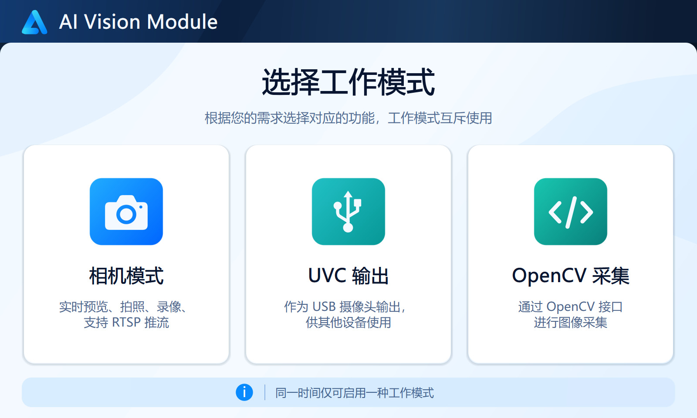
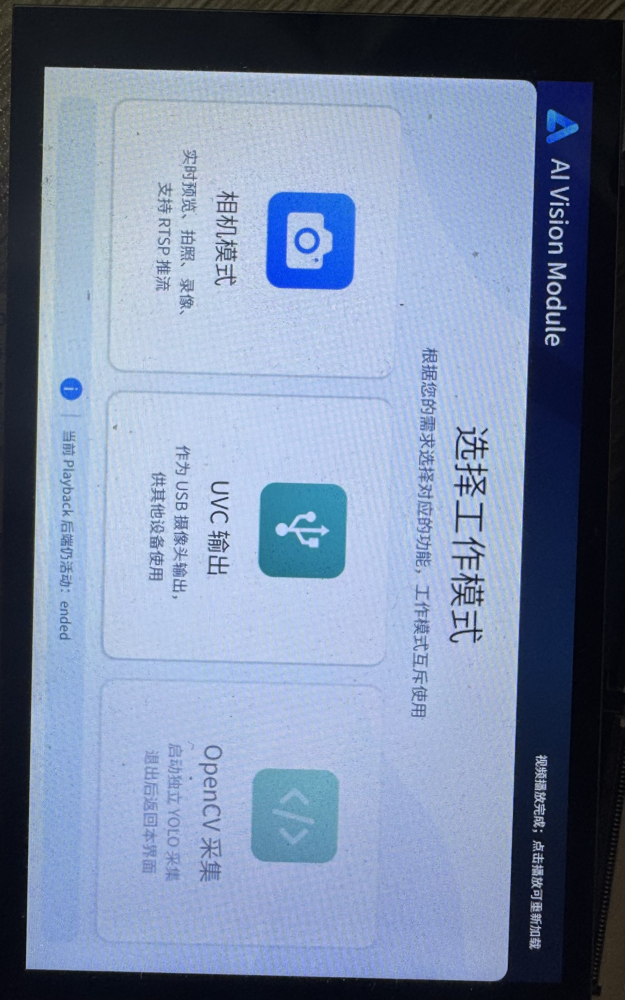
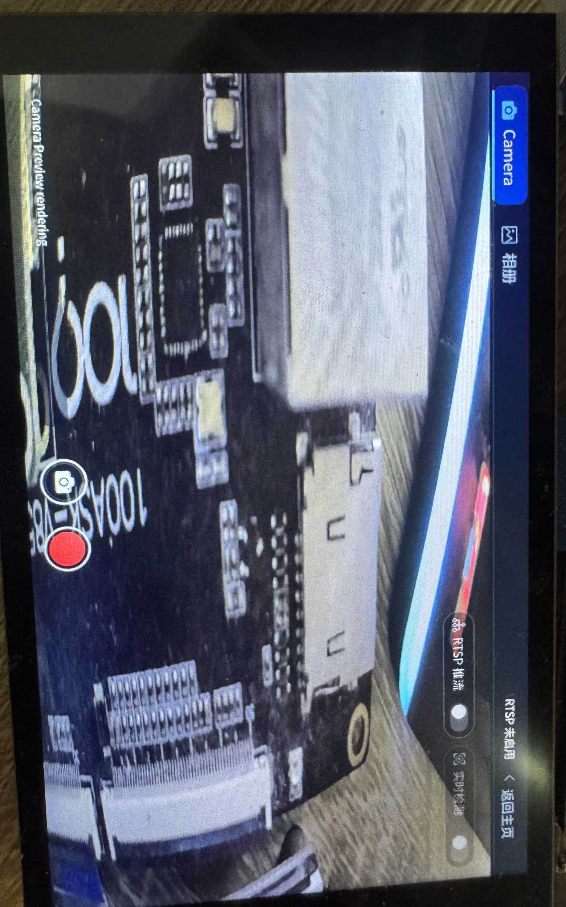
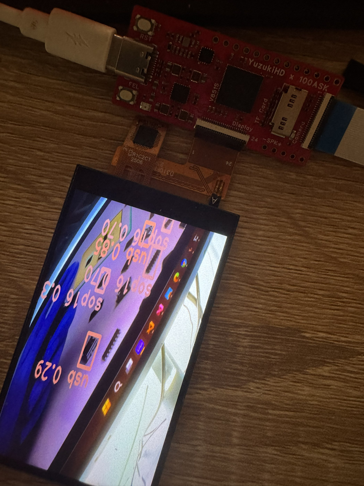
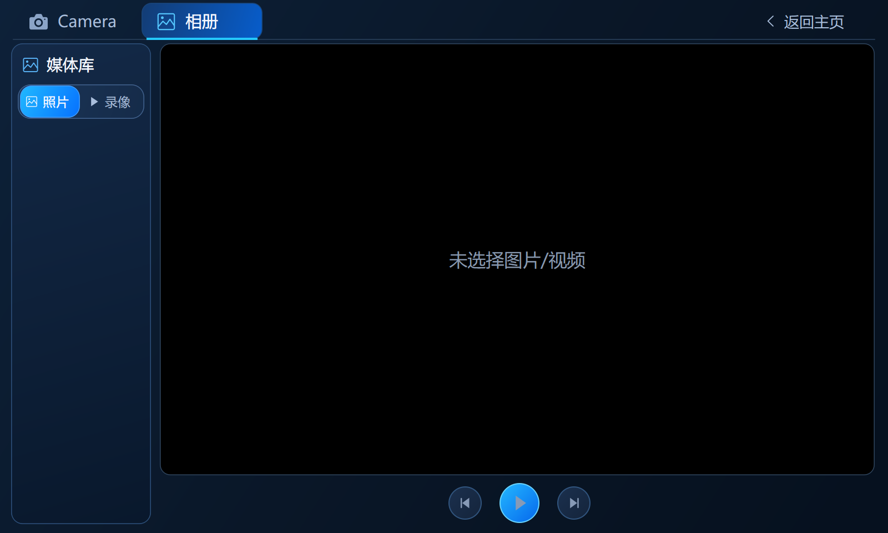
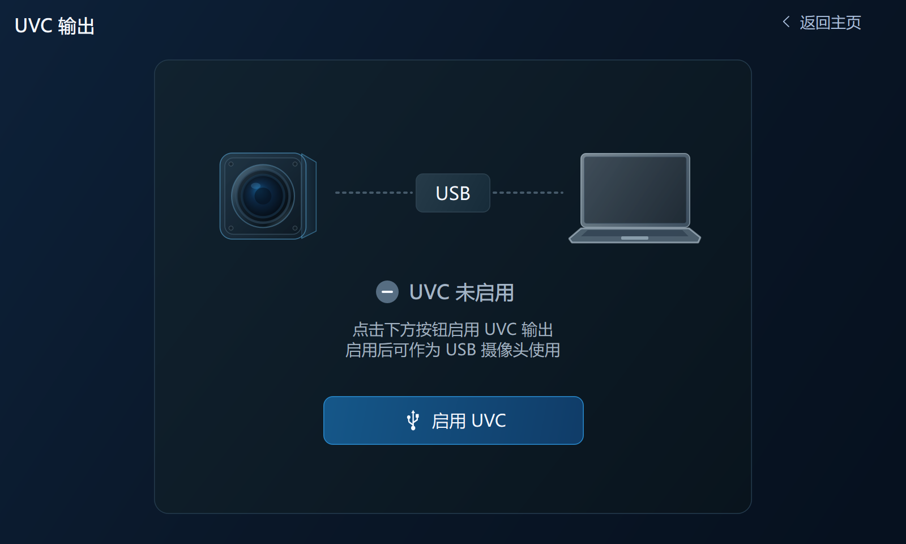
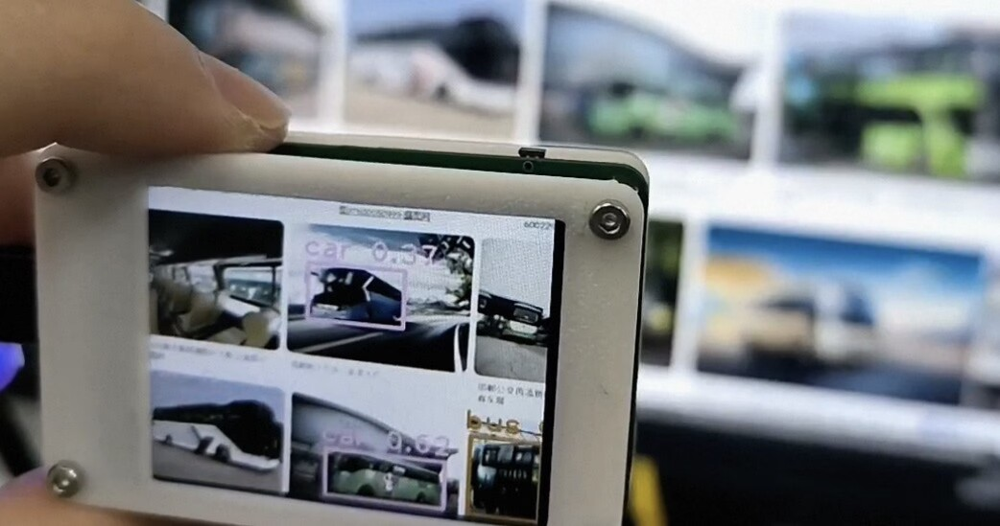

# V851S AI Vision Module

Language: **English** | [中文](README_CN.md)

This repository contains the current board-validated application delivery,
hardware projects, and Tina/OpenWrt adaptation materials for an AI camera and
edge-vision module based on the Allwinner V851S/V85x platform.

> **Current application root:** [`APP/`](APP/README.md). The former top-level
> `Application/` tree has been retired. Source code, the standalone development
> environment, installed ARM artifacts, runtime scripts, and application
> documentation now live together under `APP/`.

<p align="center">
  
</p>

## Project Highlights

The application uses Qt 5.12.9 for the user interface and separates media and
AI work into three processes. The source tree provides Camera, Album, RTSP,
UVC output, OpenCV capture, and VIPLite YOLO integration paths.

| Area | Current implementation |
| --- | --- |
| User interface | 800×480 Qt Widgets UI running on a 480×800 framebuffer through `linuxfb` rotation |
| Camera | MPP preview, JPEG snapshot, H.264/MP4 recording, and optional RTSP output |
| Album | Qt image display and MPP DEMUX/VDEC/VO video playback |
| UVC | USB camera output path using an already configured system UVC gadget |
| AI/OpenCV | OpenCV/V4L2 capture and a separate VIPLite YOLO worker |
| Resource ownership | MPP and YOLO are mutually exclusive; Qt UI and MPP video use different DISP2 layers |
| Deployment | Self-contained cross-development tree in `APP/sdk-dev` and staged ARM output in `APP/install` |

The repository includes results from real-board development, but the evidence
is feature-specific. See
[`APP/Application/docs/STATUS.md`](APP/Application/docs/STATUS.md) for the exact
tested board baseline, confirmed functions, and remaining UVC, YOLO-model, and
secondary-camera-path limitations.

## UI and Board Results

The images below are the current design and board-side results stored in
[`Image/`](Image/).

| Main interface on the board | Camera preview and controls | MPP/AI detection demonstration |
| --- | --- | --- |
|  |  |  |

| Album interface | UVC interface |
| --- | --- |
|  |  |

<p align="center">
  
</p>

## Repository Layout

```text
.
├── APP/                    Current application delivery and development tree
│   ├── Application/        Authoritative application source and CMake project
│   ├── sdk-dev/            ARM toolchain, sysroot, Qt/OpenCV/ISP development files
│   ├── install/            Staged ARM runtime produced by the current build
│   ├── runtime/            Board environment and camera-start launcher
│   ├── patches/            SDK/MPP migration records retained with the delivery
│   ├── build.sh            Supported offline cross-build entry point
│   └── APP_OVERVIEW.md     Application architecture and current defaults
├── Hardware/
│   ├── Project_for_DVP/    DVP hardware design, schematics, renders, and STEP data
│   └── Project_for_MIPI/   MIPI hardware design, schematics, Gerber, and STEP data
├── Image/                  UI renders and real-board photographs used by this README
├── tools/                  Release-asset packaging and original-path restore scripts
├── TinaSDKv4.0/            Qt/OpenCV/AWIspApi package and source inputs
├── TinaSDKv5.0/
│   ├── Project_for_DVP/    DVP Tina/OpenWrt board overlay and packages
│   └── Project_for_MIPI/   MIPI Tina/OpenWrt board overlay and packages
├── BUILD_AND_DEPLOY.md     Current build, packaging, and board deployment guide
├── RELEASE_ASSETS.md       GitHub Release asset layout and path restoration guide
├── README.md               English project entry
└── README_CN.md            Chinese project entry
```

`APP/` is now the only application entry at the repository root. Paths such as
`Application/...`, `01_APP/...`, `BUILD_README.md`, and
`TinaSDKv5.0/qt_project` belong to older layouts and should not be used.

## Application Architecture

| Program | Installed path | Responsibility |
| --- | --- | --- |
| `camera-gui` | `APP/install/usr/bin/camera-gui` | Qt UI, user interaction, backend supervision, and mode switching |
| `camera-mpp-service` | `APP/install/usr/bin/camera-mpp-service` | Exclusive MPP ownership for preview, display, snapshot, recording, RTSP, playback, and UVC |
| `camera-yolo-worker` | `APP/install/usr/libexec/v851s-camera/camera-yolo-worker` | OpenCV capture, VIPLite inference, and direct framebuffer output during the YOLO session |
| `camera-start` | `APP/install/usr/bin/camera-start` | Relocatable board-side launcher for the three-program application |

The GUI controls the MPP service through a local IPC protocol. The outer GUI
supervisor stops MPP and releases the Qt framebuffer before starting YOLO; it
recreates Qt/MPP after the YOLO worker exits. In Camera and Album sessions, Qt
owns the UI framebuffer layer while MPP owns a separate video layer composed by
DISP2.

## Build and Deploy

The current `APP/` delivery already includes the cross toolchain, target
sysroot, target Qt/OpenCV development files, imported MPP SDK, portable CMake,
and a staged install tree. Building does not require moving the source into a
Tina SDK tree and does not download dependencies.

From the repository root:

```sh
./APP/build.sh
```

The default build directory is `APP/build`; installation is staged into
`APP/install`. The three installed binaries are ARM EABI5 executables using the
musl hard-float loader `/lib/ld-musl-armhf.so.1`.

For build overrides, runtime packaging, model placement, board configuration,
and launch instructions, use the
[Build and Deployment Guide](BUILD_AND_DEPLOY.md). The compact application
overview is available in [`APP/APP_OVERVIEW.md`](APP/APP_OVERVIEW.md).
Large build dependencies and installed products are retained as path-preserving
GitHub Release assets; packaging and restore instructions are in
[`RELEASE_ASSETS.md`](RELEASE_ASSETS.md).

## Current Default Board Profile

The machine-readable defaults are owned by
[`APP/Application/configs/mpp-service.conf`](APP/Application/configs/mpp-service.conf)
and [`APP/runtime/board-env.sh`](APP/runtime/board-env.sh). The current profile
uses:

- a 480×800 physical framebuffer/VO canvas with an 800×480 logical Qt UI;
- Qt `linuxfb` rotation of 90 degrees and the configured touchscreen transform;
- VIPP0 at 480×800 for preview;
- on-demand VIPP4 at 1280×720 for snapshot, record, and RTSP, which requires the
  corresponding firmware node to be enabled;
- RTSP defaults of `eth0`, port `8554`, stream `ch0`;
- UVC output device `/dev/video2`;
- media paths below `/mnt/extsd`, which must be changed when that path is not the
  actual mounted data volume.

Do not infer another board's layer handle, touchscreen node, media mount,
camera node, or USB gadget configuration from these defaults.

## Hardware and BSP Variants

The hardware renders and PCB layout images from the previous README are kept
below. Their source files remain in the corresponding hardware project
directories.

| DVP board render | DVP PCB layout |
| --- | --- |
|  |  |

<p align="center">
  
</p>

| Variant | Hardware project | Tina/OpenWrt materials | Intended use |
| --- | --- | --- | --- |
| DVP | `Hardware/Project_for_DVP` | `TinaSDKv5.0/Project_for_DVP` | DVP camera and the simpler board bring-up path |
| MIPI | `Hardware/Project_for_MIPI` | `TinaSDKv5.0/Project_for_MIPI` | MIPI/ISP path, full vendor media stack, and the primary integrated application route |

`TinaSDKv4.0/` retains the Qt 5.12.9, OpenCV 4.1.0, and AWIspApi source/package
inputs used by the development environment. The `TinaSDKv5.0/Project_for_*`
directories contain board overlays and package changes, not complete standalone
Tina SDK checkouts.

## Platform References

- [Tina Linux development resources](https://tina.100ask.net/)
- [Allwinner open-source SDK acquisition guide](https://v853.docs.aw-ol.com/study/study_3getsdktoc/)
- [Youmu PI-V851S development resources](https://forums.100ask.net/t/topic/3009)
- [MPP usage reference](https://forums.100ask.net/t/topic/3107)
- [E907 development reference](https://forums.100ask.net/t/topic/7119)
